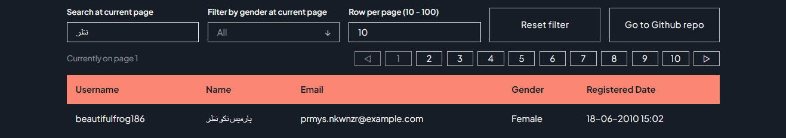
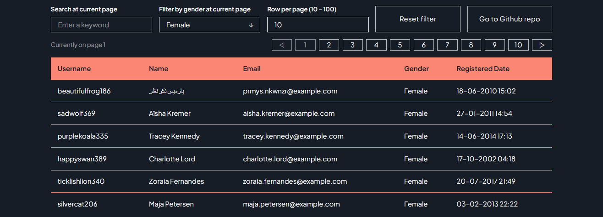
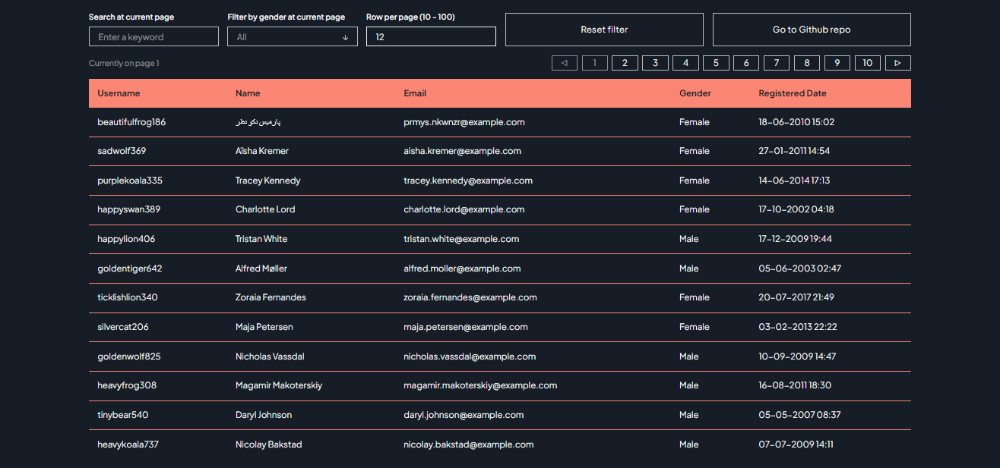
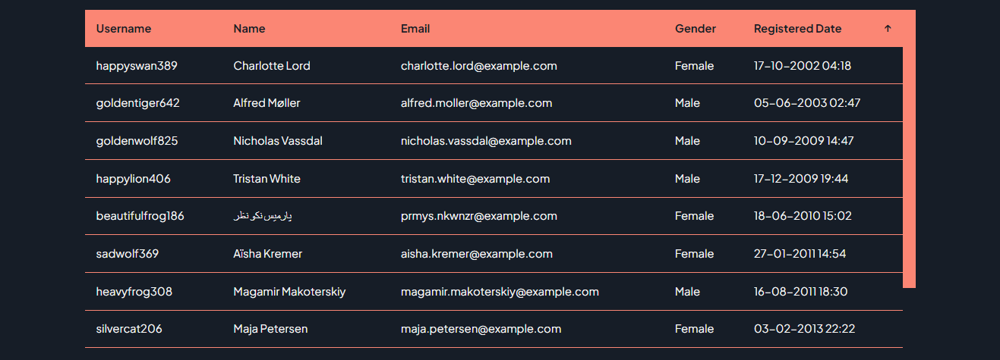
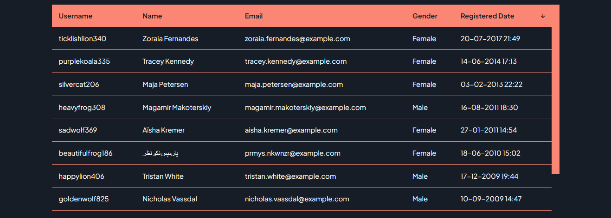
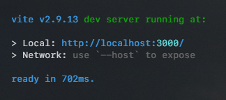

<br/>
<div align="center">
  

  <h3 align="center">Ajaib SFS app</h3>

  <p align="center">
    A search, filter, and sort (SFS) app feeding from Random User API
  </p>
</div>
<br/>

### Access the live demo following <a href="https://ajaib-sfs.vercel.app/">this</a> link

<br/>

### Framework, library, language or API is used in this app

- [Vite.js - Framework / Bootstrap](https://vitejs.dev/)

- [React.js - Renderer library](https://reactjs.org/)

- [Random User - API data provider](https://randomuser.me/)

- [SCSS - CSS styling superset](https://sass-lang.com/)

<br/>

## Starting points

- App guidance starts <a href="#guide">here</a>

- Spin up development server start <a href="#development">here</a>

- A few notes regarding the app filtering feature start <a href="#notes">here</a>

<div id="guide"></div>
<br/>

## App Guidance

In this section, we will be looking at how to use the app

- First of all, open up the app, either from the <a href="https://ajaib-sfs.vercel.app/">live demo</a> or <a href="#development">development server</a>

- At first glance, you can view the title of the app, filtering options, pagination, and lists of data on page one (oh, and my name at the top right, it's a link to my site, work in progress btw :)


- Now, we will be getting to know with filtering feature in this app (noting that the **filtering feature is being processed in sequence** as follows: **gender? => search? => sort?**), starting with

    * Filter by keyword using Search. We can search any word contained inside data(table) from this field, noting that this feature is searching per sub-string basis

    

    * Filter by gender. This one is quite self-explanatory the filtering parameter is by gender

    

    * Row per page is a way for us to set how much data will be displayed per page fetch

    

    * To filter sort by column, we can click on the table header. Each time we click another column, other column sorts will be replaced by a newly selected column. By toggling one column we can switch between ascending(↑) or descending(↓) denoted by an arrow up or down

    
    

    * Finally, our last feature for filtering is reset filters, this function(button) is for, well, resetting all of our currently active filters back to their initial state.

    

- As we're done with filtering features, we can continue into our beloved pagination feature. It's positioned right between filtering features.

    * You can either click the page number or click the arrow. Arrow will take you directly into a new head of number, ex: from 10 to 21.

    * Noting that this list of pagination doesn't have any limit, thanks to its API features.

    

<div id="development"></div>
<br/>

## Spin up development server

In this section, we're going to spin our development server locally, let's go. Following this step

- The first thing we need to do is, yes, clone the repository

    ```sh
    git clone https://github.com/yusrmuttaqien/ajaib-SFS-app.git
    ```

- Go into our newly created directory by git

   ```sh
   cd ajaib-SFS-app
   ```

- Install all required packages listed on `packages.json`

   ```sh
   npm i
   ```

- After all of those texts are done spitting, as long there is no red-colored text, we're good to go, spin that development server up!

   ```sh
   npm run dev
   ```

- If the below text is already showing, we're good to go, access the app in the browser at `http://localhost:3000/`

    

- Happy using the app!

<div id="notes"></div>
<br/>

## A few notes regarding the app filtering feature

There are a few notes about filtering features between this app and the example PDF

- In the example API usage, there is some query(feature) that doesn't exist (anymore?). Such as search by keyword and sort by column(or key in object notation). In order to keep serving those features what is applied here is locally order data only on the current data, to keep things simple.

- For filtering by gender, the API itself does provide a query for the exact thing. But in this case, I didn't use those queries, reason, and solutions are provided in the following points

    * Filter by gender didn't work with seed query which is needed for pagination to actually work and be consistent between page changes.

    * In order to negotiate those limitations, filter by gender performed locally and only apply to the current data.

- Order by column, at first will be implemented to be capable to do multiple columns at once. But because the data shown on one page is not that much yet, and the data received is quite random :), it's hard to see the result of multi-column ordering. As result, I resort to implementing only ordering one column at one time.

- Despite all of those limitations, all filtering options could be run sequentially on the same data, with the proper order of filtering in place.

    * Also, the same filtering will be run when changing the page, as long the filtering option has not been reset yet.

<br/>

## Credits

### <a href="https://github.com/yusrmuttaqien">Yusril Muttaqien</a> - 2022
